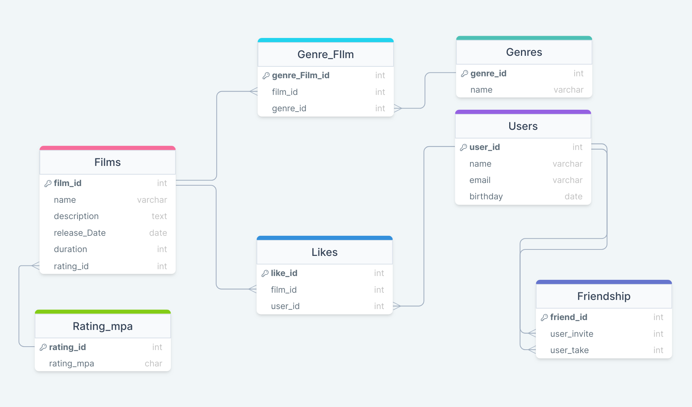

# 

Java-Filmorate - это backend-приложение для сервиса, которое работает с фильмами и оценками пользователей, 
может возвращать топ фильмов, рекомендованных к просмотру. В данном приложении использованы следующие технологии: Spring, Lombok, PostgreSQL

<h3>Films</h3>

Содержит данные о фильме 🎥  
- film_id - идентификатор фильма 
- name - название фильма 
- description - описание фильма 
- realase_date - дата выхода фильма 
- rating_id - внешний ключ на рейтинг по системе MPA 

<h3>Rating_mpa</h3>

Содержит данные о рейтинге фильма по системе MPA 🔓 
- rating_id - идентификатор рейтинга 
- rating_mpa - значения рейтинга (например: G, PG, NC-17 и т.д.)

<h3>Genres</h3>

Содержит информацию о жанрах 📺
- genre_id - идентификатор жанра
- name - название жанра

<h3>Genre_film</h3>

Содержит информацию о жанре фильма 📼  
- id - идентификатор жанра фильма 
- genre_id - внешний ключ на таблицу о жанрах 

<h3>Likes</h3>

Содержит информацию о количестве лайков ❤️ 
- like_id - идентификатор лайков 
- film_id - внешний ключ на таблицу фильмов 
- user_id - внешний ключ на таблицу пользователей 

<h3>Users</h3>

Содержит информацию о пользователях 👦 
- user_id - идентификатор пользователя 
- name - имя пользователя 
- email - почта пользователя 
- birthday - День Рождение пользователя 

<h3>Friendship</h3>

Содержит информацию о дружбе между пользователями 👋 
- friend_id - идентификатор о дружбе 
- user_invite - ид пользователя, предложившего дружбу 
- user_take - ид пользователя, принявшего предложение о дружбе 

